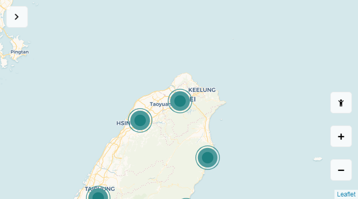

# 台灣藥局口罩販售地圖

- 依照藥局的經緯度, 製作 Marker 在地圖上.

- 每個 Marker 點擊後能顯示藥局的資料, 並修改 hash 值, 即可使用網址追蹤藥局.

- 控制按鈕, 可以調整 Marker 的顏色是依據 成人口罩 or 兒童口罩 的數量來顯示.

- 說明欄位可以選擇 縣市 地區, 快速跳轉地圖的經緯度.

- 由於沒有後端程式, 故藥局資料僅供參考.

## GitHub Pages

[https://chuangfe.github.io/mask-map/dist/](https://chuangfe.github.io/mask-map/dist/)

## Framework

- leaflet@1.7.1

- leaflet.markercluster@1.4.1

- vue.js@2.6.14

## Copyright©

- 參考 [https://github.com/kai-tw/Mask-Map/](https://github.com/kai-tw/Mask-Map/)

- 版權 [Kai](https://www.facebook.com/kai73002981)
